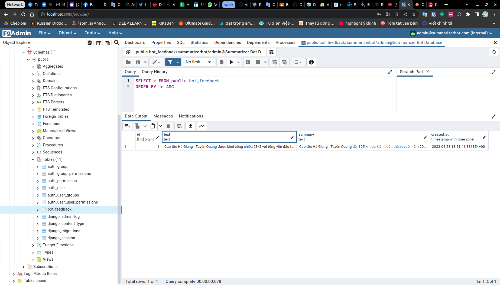

# Text Summarization Web App

## Overview

This is a web app for text summarization. It was created as part of the pre-entrance test for Cinnamon AI Bootcamp. The app has two parts: a demo front end with the Gradio framework, and a back end with Django. The back end also uses two apps for managing the database: PostgreSQL and pgAdmin4. In production, the app also uses an Nginx proxy.

The core tech of this app is [ViT5-Base Finetuned on vietnews Abstractive Summarization (No prefix needed)](https://huggingface.co/VietAI/vit5-base-vietnews-summarization). I used 2 technologies of optimum with onnx runtime of huggingface to reduce size and improve speed for inferencing. The first is optimization  rebuilds the computation graph and the second is floating-point quantization.In this [notebook](app/bot/model/onnx.ipynb) is a guide on how to make a more productive inferenceable model using the optimum library.

## Features
There are two increments in this simple application, summarize and contribute

1. Summarization

The summarization feature in web app allows you to quickly and easily summarize any text, article, or document. Simply enter the text you want to summarize into the text box and click the "Submit" button. The app will then generate a summary of the text in one second.


2. Contribute

The contribute feature in web app allows you to help us collect more quality data for our next training. Simply enter the long text and summary of the text into the text boxes and click the "Contribute" button. The app will then store the data in our database and we will be able to use it to improve our text summarization model.


I created a database management tool called pgAdmin4. This tool allows us to manage all of the data that our clients contribute. I have included the default account credentials for logging into pgAdmin4 in the `.env.dev` file. 


We have a simple query like this:




## Installation
Here are instructions for installing, using and developing more features:
### Development
1. Backend:
    - Clone project
    - Build docker compose and up them 
    - makemigrations and migrate
    - Login pgadmin4 to mamage database with default account `PGADMIN_DEFAULT_EMAIL` and `PGADMIN_DEFAULT_PASSWORD` in `.env.dev` file
    - Should use docker desktop to see log of containers


2. Frontend:
    - Clone project 
    - Build docker image and up it
    - Launch GUI with the [link](http://127.0.0.1:7860/)

### Production
I will do when I have money in my account to rent the cloud :)). But it's also simple to do as I have created more nginx app for proxy in docker-compose.prod.yml

Need to collect all static files before rendering
```
$ docker-compose -f docker-compose.prod.yml up -d --build
$ docker-compose -f docker-compose.prod.yml exec summarizerbot python manage.py migrate --noinput
$ docker-compose -f docker-compose.prod.yml exec summarizerbot python manage.py collectstatic --no-input --clear
```

## Common problems
Exits running app in port 5432
```
sudo lsof -i -P -n | grep 5432
sudo kill <process id>
```

## Video content
- demo GUI and all features
- Intallation of backend and frontend for development:
    - Backend:
        - Clone project
        - Build docker compose and up them 
        - makemigrations and migrate
        - Login pgadmin4 to mamage database with default account `PGADMIN_DEFAULT_EMAIL` and `PGADMIN_DEFAULT_PASSWORD` in `.env.dev` file
        - Should use docker desktop to see log of containers
    - Frontend:
        - Clone project 
        - Build docker image and up it
        - Launch GUI with the [link](http://127.0.0.1:7860/)


